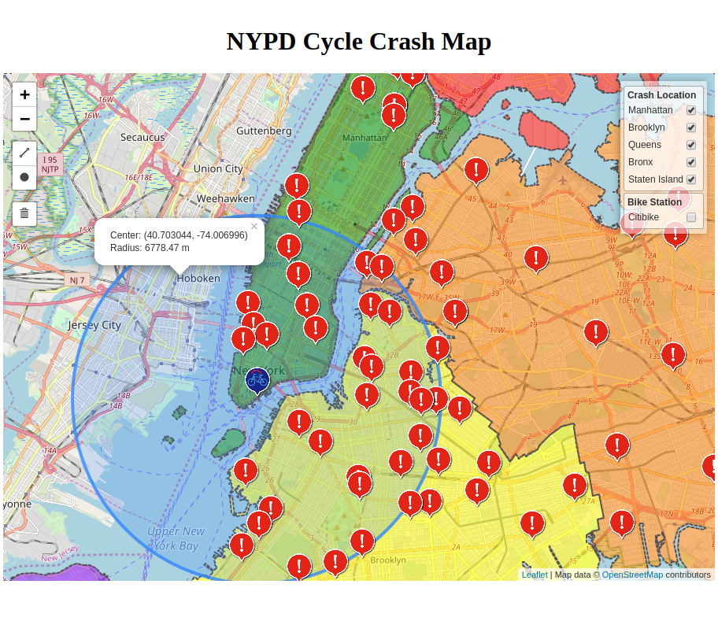

# Cycle Crash Visualization

## Install
### Prepare Python 3.7
Need at least Python3.7 installed, skip following block if py3.7 installed in ubuntu
```console
sudo add-apt-repository ppa:deadsnakes/ppa
sudo apt update
sudo apt install python3.7 python3.7-venv
```
### Clone the code
```console
git clone https://github.com/ZhizhenWang/cycle_crash.git
```

### Create a virutalenv and activate it  
Linux Platform:
```console
$ python3.7 -m venv venv
$ . venv/bin/activate
```
Or on Windows cmd:
```console
> py -3 -m venv venv
> venv\Scripts\activate.bat
```
### Install package
If cycle crash is installed, we can use it anywhere
```console
$ pip install -e .
```
## Prepare data
Downlaod the Motor Vehicle Collisions - Crashes csv file `https://data.cityofnewyork.us/api/views/h9gi-nx95/rows.csv?accessType=DOWNLOAD`, 
and move into `cycle_crash/cycle_crash`

## Run the application
First generate the sqlite database, then run the flask app
```console
$ export FLASK_APP=cycle_crash
```
Or on Windows cmd:
```console
> set FLASK_APP=cycle_crash
```
Initalize database
```console
$ flask init-db
```
Run with a production WSGI server
```console
$ pip install waitress
$ waitress-serve --call 'cycle_crash:create_app'
```
Open <http://0.0.0.0:8080/> in a browser.

## Web Interaction Decribe


- To show bike crash location in different boroughs and bike station, click on the checkbox in the upper right panel.

    > Bike station is blue marker, and crash location is red marker.

- To see detailed info, just click on the marker, popup window will be shown.

- To check one bike station, just click on the station marker, other stations will be hide. Click it again to show info windows.

- To measure distance between different marker, use ruler on the upper left. The distance in km will be displayed. Or draw circle with specific radius to see the how close they are.

## API
Get the crash information by borough `("Manhattan", "Brooklyn", "Queens", "Bronx", "Staten Island")`   
`GET /crash/{borough_name}`

Get all bike station information  
`GET /stations`

## Feature work
- Generate API documentation
- Call the NYPD data from API endpoint instead of download it manually
- Use python sqlalchemy for ORM
- Add map fullscreen button
- Color crash marker to show how far they're from station point